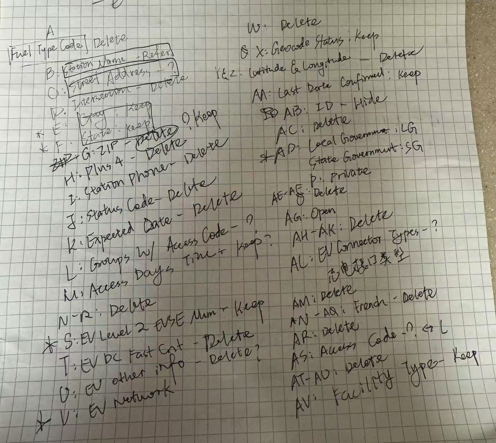

Last weekend on 02/08, I attended the datathon DataI/O hosted by OSU BDAA at Keenan Enterpreneaurship Center. In 8 hours, we did some great progress in analyzing some data closely related to electric vehicle. Although the result was not so good, it can count I carried two complete data science rookies.

The first stuff we did was some general most basic most rookie operations to the dataset we needed to deal with. The only thing I did in the data cleaning stage was just going through every column in MS Excel and tried to decide which columns I was going to get rid of.

To make a long story short, it was not meaningful at all because I did not really care those columns at all in the data operation process lmao.
